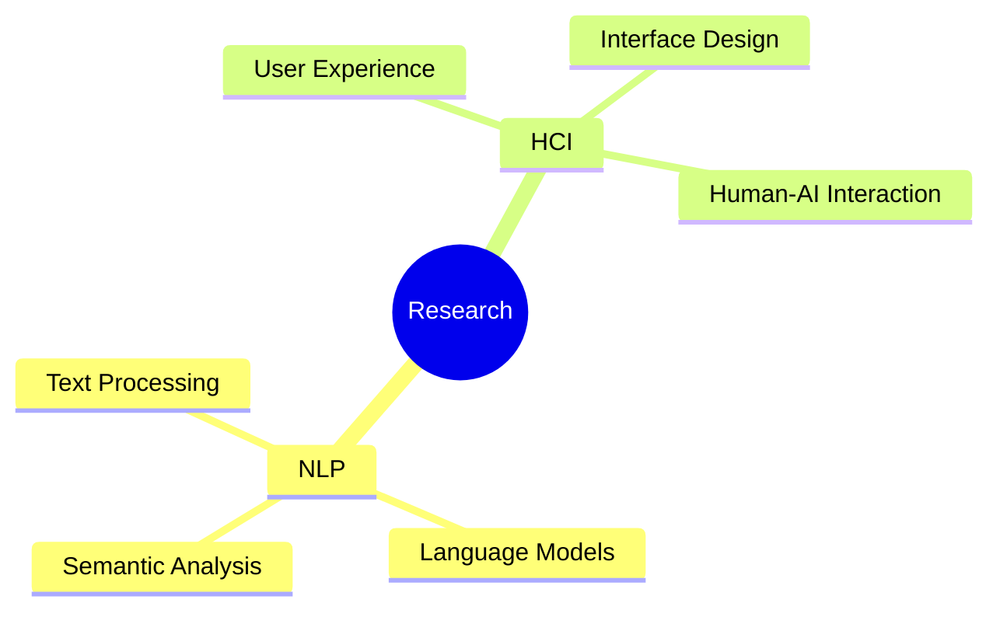

# 👋 Hello, I'm Huiqi Zou

  

---

## 🎓 Academic Journey

| Degree | Institution | Field |
|--------|-------------|-------|
| **PhD** | Northeastern University | Computer Engineering |
| **MS** | Johns Hopkins University | Engineering in Computer Science |
| **BS** | City University of Hong Kong | Computer Science |

## 💼 Professional Experience

- **🏢 Siemens** - Research Intern
  - Applied cutting-edge technology solutions in industrial settings
  - Gained hands-on experience in enterprise-level software development

## 🔬 Research Focus

### 🧠 **Natural Language Processing (NLP)**
- Exploring advanced language understanding and generation
- Working on innovative applications of large language models

### 🤝 **Human-Computer Interaction (HCI)**
- Designing intuitive user interfaces
- Researching human-AI collaboration patterns

## 📊 GitHub Stats

  

## 🛠️ Tech Stack

## 📈 Activity Graph

  

## 🏆 Achievements

  

## 📫 Let's Connect!

**📧 Email:** zou.huiq@northeastern.edu

---

  
*"Bridging the gap between human intelligence and artificial intelligence through innovative research and thoughtful design."*

<!---
AnnaZou1103/AnnaZou1103 is a ✨ special ✨ repository because its `README.md` (this file) appears on your GitHub profile.
You can click the Preview link to take a look at your changes.
--->